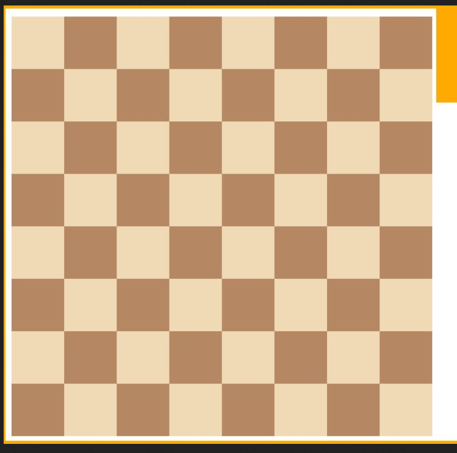

## Lesson 11

---

## **Loyiha Nomi: Kontakt/Telefon Kitobi (Phone Book)**


### **Loyiha Shartlari:**

#### **1. Komandalarni Ko'rsatish (Display Commands)**
- **Ta'rif:**
  - Foydalanuvchi tizim bilan qanday komandalar orqali o'zaro aloqada bo'lishini bilishi uchun mavjud komandalarni chiqarish.
- **Talablar:**
  - Dastur ishga tushganda yoki ma'lum bir komandani kiritganda, barcha mavjud komandalar ro'yxatini ko'rsatishi kerak.
  - Har bir komandani qisqacha tavsiflash.
- **Mavjud Komandalar:**
  ```
  Mavjud komandalar:
  - add: Yangi kontakt qo'shish
  - search: Kontaktni qidirish
  - delete: Kontaktni o'chirish
  - list: Barcha kontaktlarni ko'rsatish
  - help: Mavjud komandalarni ko'rsatish
  - exit: Dasturdan chiqish
  ```

#### **2. Kontakt Qo'shish (Add Contact)**
- **Ta'rif:**
  - Foydalanuvchi ism va telefon raqamini tizimga qo'shishi kerak.
- **Talablar:**
  - Foydalanuvchi dan kontaktning ismi va telefon raqami so'ralishi.
  - Kiritilgan ma'lumotlar to'g'ri formatda ekanligini tekshirish (masalan, telefon raqami faqat raqamlardan iborat bo'lishi).
  - Yangi kontaktni mavjud kontaktlar ro'yxatiga qo'shish.
- **Misol:**
  ```
  Komanda: add
  Ism: Alice
  Telefon: 1234567890
  Kontakt muvaffaqiyatli qo'shildi!
  ```

#### **3. Kontakt Qidirish (Search Contact)**
- **Ta'rif:**
  - Foydalanuvchi berilgan 3 yoki 4 raqam bilan mos keladigan barcha telefon raqamlarini qidirishi va ularning tegishli kontaktlarini ko'rsatishi kerak.
- **Talablar:**
  - Foydalanuvchi dan qidiruv uchun qisqa telefon raqami (3 yoki 4 raqam) so'ralishi.
  - Tizimda kiritilgan raqam bilan mos keladigan barcha kontaktlarni qidirish.
  - Topilgan kontaktlarni konsolga chiqarish.
  - Agar hech qanday kontakt topilmasa, mos keladigan kontakt yo'qligini bildirish.
- **Misol:**
  ```
  Komanda: search
  Qidirilayotgan raqam (3-4 raqam): 123
  Topilgan kontaktlar:
  - Alice: 1234567890
  - Bob: 9123456789
  ```

#### **4. Kontakt O'chirish (Delete Contact)**
- **Ta'rif:**
  - Foydalanuvchi mavjud kontaktni telefon raqami yoki ismi orqali o'chirishi kerak.
- **Talablar:**
  - Foydalanuvchi dan o'chiriladigan kontaktning ismi yoki telefon raqami so'ralishi.
  - Tizimda kiritilgan ma'lumotga mos keladigan kontaktni qidirish.
  - Topilgan kontaktni ro'yxatdan o'chirish.
  - Agar hech qanday kontakt topilmasa, mos keladigan kontakt yo'qligini bildirish.
- **Misol:**
  ```
  Komanda: delete
  O'chiriladigan kontakt ismi yoki raqami: Alice
  Kontakt muvaffaqiyatli o'chirildi!
  ```

#### **5. Barcha Kontaktlarni Ko'rsatish (List Contacts)**
- **Ta'rif:**
  - Foydalanuvchi barcha mavjud kontaktlarni ko'rishi kerak.
- **Talablar:**
  - Mavjud kontaktlar ro'yxatini tartibli tarzda konsolga chiqarish.
  - Agar telefon kitobi bo'sh bo'lsa, bunga tegishli xabar ko'rsatish.
- **Misol:**
  ```
  Komanda: list
  Barcha kontaktlar:
  - Alice: 1234567890
  - Bob: 0987654321
  - Charlie: 5551234567
  ```

#### **6. Mavjud Komandalarni Ko'rsatish (Help)**
- **Ta'rif:**
  - Foydalanuvchi `help` komandasi orqali mavjud komandalarni ko'rishi mumkin.
- **Talablar:**
  - Mavjud komandalar ro'yxatini va ularning qisqacha tavsifini ko'rsatish.
- **Misol:**
  ```
  Komanda: help
  Mavjud komandalar:
  - add: Yangi kontakt qo'shish
  - search: Kontaktni qidirish
  - delete: Kontaktni o'chirish
  - list: Barcha kontaktlarni ko'rsatish
  - help: Mavjud komandalarni ko'rsatish
  - exit: Dasturdan chiqish
  ```

#### **7. Dasturdan Chiqish (Exit)**
- **Ta'rif:**
  - Foydalanuvchi `exit` komandasi orqali dasturdan chiqishi mumkin.
- **Talablar:**
  - Dasturdan chiqishda foydalanuvchiga xabar ko'rsatish va dastur ish faoliyatini to'xtatish.
- **Misol:**
  ```
  Komanda: exit
  Dasturdan chiqish...
  ```

### **Qo'shimcha Talablar:**

- **Ma'lumotlarni Saqlash:**
  - Kontaktlar ob'ektlar orqali saqlanadi.
  - Barcha kontaktlar bitta ob'ektda yoki massivda saqlanishi mumkin.

- **Foydalanuvchi Interfeysi:**
  - Dastur browser (prompt, console) orqali ishlaydi.
  - Foydalanuvchi qulayligi uchun komandalar va ularning tavsiflari ko'rsatiladi.

- **Xatoliklarni Boshqarish:**
  - Noto'g'ri komandalarni kiritishda foydalanuvchiga xato haqida ma'lumot berish.
  - Telefon raqami formatini tekshirish va xato bo'lsa, qayta so'rash.
  ```
  +998941234567
        yoki
  941234567
  ```


-----------------


  # 11-dars. HOME WORK MASALALAR

  1. Minimum Remove to Make Valid Parentheses
  > Given a string s of `'('` , `')'` and lowercase English characters.

  > Your task is to remove the minimum number of parentheses ( `'('` or `')'`, in any positions ) so that the resulting _parentheses string_ is valid and return **any** valid string.

  Formally, a _parentheses string_ is valid if and only if:

  - It is the empty string, contains only lowercase characters, or
  - It can be written as `AB` (`A` concatenated with `B`), where `A` and `B` are valid strings, or
  - It can be written as `(A)`, where `A` is a valid string.


**Example 1:**

    **Input:** s = "lee(t(c)o)de)"
    **Output:** "lee(t(c)o)de"
    **Explanation:** "lee(t(co)de)" , "lee(t(c)ode)" would also be accepted.

  **Example 2:**

    **Input:** s = "a)b(c)d"
    **Output:** "ab(c)d"

  **Example 3:**

    **Input:** s = "))(("
    **Output:** ""
    **Explanation:** An empty string is also valid.


  ----
  3. Roman to Integer

  >Roman numerals are represented by seven different symbols: `I`, `V`, `X`, `L`, `C`, `D` and `M`.

    **Symbol**       **Value**
    I             1
    V             5
    X             10
    L             50
    C             100
    D             500
    M             1000

  For example, `2` is written as `II` in Roman numeral, just two ones added together. `12` is written as `XII`, which is simply `X + II`. The number `27` is written as `XXVII`, which is `XX + V + II`.

  Roman numerals are usually written largest to smallest from left to right. However, the numeral for four is not `IIII`. Instead, the number four is written as `IV`. Because the one is before the five we subtract it making four. The same principle applies to the number nine, which is written as `IX`. There are six instances where subtraction is used:

  - `I` can be placed before `V` (5) and `X` (10) to make 4 and 9. 
  - `X` can be placed before `L` (50) and `C` (100) to make 40 and 90. 
  - `C` can be placed before `D` (500) and `M` (1000) to make 400 and 900.

  Given a roman numeral, convert it to an integer.

  **Example 1:**

    **Input:** s = "III"
    **Output:** 3
    **Explanation:** III = 3.

  **Example 2:**

    **Input:** s = "LVIII"
    **Output:** 58
    **Explanation:** L = 50, V= 5, III = 3.

  **Example 3:**

    **Input:** s = "MCMXCIV"
    **Output:** 1994
    **Explanation:** M = 1000, CM = 900, XC = 90 and IV = 4.

  ----

  4. Contains Duplicate II
  > Given an integer array `nums` and an integer `k`, return `true` _if there are two **distinct indices**_ `i` _and_ `j` _in the array such that_ `nums[i] == nums[j]` _and_ `abs(i - j) <= k`.

  **Example 1:**

    **Input:** nums = [1,2,3,1], k = 3
    **Output:** true

  **Example 2:**

    **Input:** nums = [1,0,1,1], k = 1
    **Output:** true

  **Example 3:**

    **Input:** nums = [1,2,3,1,2,3], k = 2
    **Output:** false


  5.  Bilmasvoy matematikada

  Bilmasvoy matematikaga qiziqib qoldi. Misollar ishlashni ham boshladi. Lekin 
  ni hisoblashda biroz qiynalyapti. Siz bu ifodani hisoblashda Bilmasvoyga yordam bering.

  !x["sasa"](pictures/formula.png)

  ---

  Kiruvchi ma'lumotlar:

  Sizga yagona qatorda a, b, c , d natural sonlari beriladi(1 ≤ a, b ≤ 1018, 1 ≤ c, d ≤ 10 500000 ).

  ---

  Chiquvchi ma'lumotlar:

  Ifoda qiymatining 109+7 ga bo'lgandagi qoldiqni chop eting!

  ---

  Misollar

  | #   | input   | output |
  | --- | ------- | ------ |
  | 1   | 1 1 1 1 | 1      |


  ------

  6. Defis - bu chiziqcha

  S matn yoki so'z beriladi. Sizning vazifangiz ushbu matndagi so'zlarni [defis](https://uz.wikipedia.org/wiki/Defis) bilan ajratishingiz kerak. Matndagi so'z 10 belgidan oshsa so'zning o'rtasiga defis qo'yilgan holda ikkiga bo'lib, agar matndagi so'z 10 belgidan oshsa va belgilar soni toq bo'lib qolsa so'zining ikkinichi tomoniga ortiqcha bo'lib qolgan belgini qo'shib ikkiga bo'lingan holda chop eting.

  ---

  Kiruvchi ma'lumotlar:

   bitta qatorida matn yoki so'z.

  ---

  Chiquvchi ma'lumotlar:

  Chiqish faylida masala javobini chop eting.

  ---

  Misollar

  | #   | input                    | output                   |
  | --- | ------------------------ | ------------------------ |
  | 1   | Assalomu Alaykum Javohir | Assalomu-Alaykum-Javohir |
  | 2   | Robocontest contest      | Roboc-ontest-contest     |
  | 3   | Bilmasvoyta'tilda        | Bilmasvo-yta'tilda       |

  ----
  7. ASCII code chiqarish
  > function bitta paramert olsin u string ko'rinishda yoki son shu kiritilgan parametrini **ascii** codeni chiqarishi kerak


  ---
  8. Find the Largest Even Number

  > Write a function that finds the largest number in an array `nums` that is also even. If there is no even number, return `-1`.

  > Eng katta juft sonni qaytaradigan function yarating u array qabul qilsin.
  ### Examples

  ```js
  largestEven([3, 7, 2, 1, 7, 9, 10, 13]) ➞ 10

  largestEven([1, 3, 5, 7]) ➞ -1

  largestEven([0, 19, 18973623]) ➞ 0
  ```
  -----
  9. Loop ishlatgan holatda shahmat doskasini chiqarish

  


  ----
  ==BONUS==

  ## White Spaces Between Lower and Uppercase Letters

  Write a function that inserts a white space between every instance of a lower character followed immediately by an upper character.

  ### Examples

  ```
  insertWhitespace("SheWalksToTheBeach") ➞ "She Walks To The Beach"

  insertWhitespace("MarvinTalksTooMuch") ➞ "Marvin Talks Too Much"

  insertWhitespace("TheGreatestUpsetInHistory") ➞ "The Greatest Upset In History"
  ```


  2. Solve the Equation

  > Solve a given equation and return the value of `'x'` in the form of a string `"x=#value"`. The equation contains only `'+'`, `'-'` operation, the variable `'x'` and its coefficient. You should return `"No solution"` if there is no solution for the equation, or `"Infinite solutions"` if there are infinite solutions for the equation.

  If there is exactly one solution for the equation, we ensure that the value of `'x'` is an integer.

  **Example 1:**

    **Input:** equation = "x+5-3+x=6+x-2"
    **Output:** "x=2"

  **Example 2:**

    **Input:** equation = "x=x"
    **Output:** "Infinite solutions"

  **Example 3:**

    **Input:** equation = "2x=x"
    **Output:** "x=0"

  **Constraints:**

  - `3 <= equation.length <= 1000`
  - `equation` has exactly one `'='`.
  - `equation` consists of integers with an absolute value in the range `[0, 100]` without any leading zeros, and the variable `'x'`.


  ==DARSDA SHU MASALALARNI O'ZIM TANLAB BIR ODAMGA BERAMAN AGARDA **AI** YOZGAN BO'LSA BAHO 0 QO'YILADI VA QATTIQ CHORA KO'RILADI==
